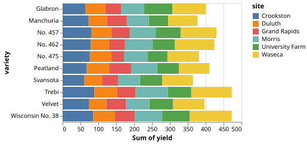

# VlConvert

VlConvert converts Vega-Lite and Vega chart specifications to a variety of static and interactive formats including SVG, PNG, PDF, HTML, and more. It also converts Vega-Lite to Vega.

It runs the official Vega and Vega-Lite JavaScript libraries in an embedded Deno runtime, so it does not require a browser or Node.js installation. It bundles these libraries and their dependencies so access to an online CDN is not required for it to operate. Network requests occur only for remote data, images, fonts, or plugins that the input spec or configuration references.

## How it works

VlConvert's core is a Rust library, and the project additionally provides Python, CLI, and server interfaces to the same conversion functionality. See [How it works](how-it-works/index.md) for more information.

## Example

Use the interface tabs and format selector below to view example code snippets for converting a Vega-Lite specification to a variety of output formats.

<!-- Regenerate the checked-in outputs with `pixi run docs-preview-chart`. -->

:::{dropdown} stacked_bar_h.vl.json
:open:

```{literalinclude} _examples/stacked_bar_h.vl.json
:language: json
```
:::

:::::::{container} conversion-example

```{raw} html
<div class="conversion-example__format">
  <label>
    Output
    <select class="conversion-example__format-select">
      <option value="svg" data-file="_static/charts/stacked_bar_h.svg" data-preview="image">SVG</option>
      <option value="png" data-file="_static/charts/stacked_bar_h.png" data-preview="image">PNG</option>
      <option value="jpeg" data-file="_static/charts/stacked_bar_h.jpg" data-preview="image">JPEG</option>
      <option value="pdf" data-file="_static/charts/stacked_bar_h.pdf">PDF</option>
      <option value="html" data-file="_static/charts/stacked_bar_h.html" data-preview="html">HTML</option>
      <option value="vega" data-file="_static/charts/stacked_bar_h.vg.json" data-preview="vega">Vega</option>
      <option value="url" data-preview="url">URL</option>
    </select>
  </label>
</div>
```

::::::{container} conversion-example-panel conversion-example-panel-svg is-active

:::::{tab-set}
:sync-group: front-page-interface

::::{tab-item} Rust
:sync: rust

```{code-block} rust
:caption: src/main.rs

use vl_convert_rs::{anyhow, VlConverter, VlOpts, VlVersion};

#[tokio::main]
async fn main() -> anyhow::Result<()> {
    let spec = std::fs::read_to_string("stacked_bar_h.vl.json")?;
    let converter = VlConverter::new();
    let output = converter
        .vegalite_to_svg(
            spec,
            VlOpts {
                vl_version: VlVersion::v6_4,
                ..Default::default()
            },
            Default::default(),
        )
        .await?;
    std::fs::write("stacked_bar_h.svg", output.svg)?;
    Ok(())
}
```

```{literalinclude} _generated/setup/Cargo.toml
:language: toml
:caption: Cargo.toml
```
::::

::::{tab-item} Python
:sync: python

```{code-block} python
:caption: main.py

from pathlib import Path

import vl_convert as vlc

spec = Path("stacked_bar_h.vl.json").read_text(encoding="utf-8")
svg = vlc.vegalite_to_svg(spec, vl_version="6.4")
Path("stacked_bar_h.svg").write_text(svg, encoding="utf-8")
```

```{literalinclude} _generated/setup/pyproject.toml
:language: toml
:caption: pyproject.toml
```
::::

::::{tab-item} CLI
:sync: cli

```{include} _generated/setup/install-vl-convert.md
```

Perform the conversion:

```console
$ vl-convert vl2svg \
>   --input stacked_bar_h.vl.json \
>   --output stacked_bar_h.svg \
>   --vl-version 6.4
```
::::

::::{tab-item} Server
:sync: server

```{include} _generated/setup/install-vl-convert.md
```

Start the server in one terminal:

```console
$ vl-convert serve --port 3000
```

Save this request body:

:::{dropdown} request.json
:open:

```{literalinclude} _generated/requests/stacked-bar-h-svg.json
:language: json
```
:::

Send the request from a second terminal:

```console
$ curl http://127.0.0.1:3000/vegalite/svg \
>   -H 'Content-Type: application/json' \
>   --data-binary @request.json \
>   --output stacked_bar_h.svg
```
::::
:::::
::::::

::::::{container} conversion-example-panel conversion-example-panel-png

:::::{tab-set}
:sync-group: front-page-interface

::::{tab-item} Rust
:sync: rust

```{code-block} rust
:caption: src/main.rs

use vl_convert_rs::{anyhow, PngOpts, VlConverter, VlOpts, VlVersion};

#[tokio::main]
async fn main() -> anyhow::Result<()> {
    let spec = std::fs::read_to_string("stacked_bar_h.vl.json")?;
    let converter = VlConverter::new();
    let output = converter
        .vegalite_to_png(
            spec,
            VlOpts {
                vl_version: VlVersion::v6_4,
                ..Default::default()
            },
            PngOpts {
                scale: Some(2.0),
                ..Default::default()
            },
        )
        .await?;
    std::fs::write("stacked_bar_h.png", output.data)?;
    Ok(())
}
```

```{literalinclude} _generated/setup/Cargo.toml
:language: toml
:caption: Cargo.toml
```
::::

::::{tab-item} Python
:sync: python

```{code-block} python
:caption: main.py

from pathlib import Path

import vl_convert as vlc

spec = Path("stacked_bar_h.vl.json").read_text(encoding="utf-8")
png = vlc.vegalite_to_png(spec, vl_version="6.4", scale=2)
Path("stacked_bar_h.png").write_bytes(png)
```

```{literalinclude} _generated/setup/pyproject.toml
:language: toml
:caption: pyproject.toml
```
::::

::::{tab-item} CLI
:sync: cli

```{include} _generated/setup/install-vl-convert.md
```

Perform the conversion:

```console
$ vl-convert vl2png \
>   --input stacked_bar_h.vl.json \
>   --output stacked_bar_h.png \
>   --vl-version 6.4 \
>   --scale 2
```
::::

::::{tab-item} Server
:sync: server

```{include} _generated/setup/install-vl-convert.md
```

Start the server in one terminal:

```console
$ vl-convert serve --port 3000
```

Save this request body:

:::{dropdown} request.json
:open:

```{literalinclude} _generated/requests/stacked-bar-h-png.json
:language: json
```
:::

Send the request from a second terminal:

```console
$ curl http://127.0.0.1:3000/vegalite/png \
>   -H 'Content-Type: application/json' \
>   --data-binary @request.json \
>   --output stacked_bar_h.png
```
::::
:::::
::::::

::::::{container} conversion-example-panel conversion-example-panel-jpeg

:::::{tab-set}
:sync-group: front-page-interface

::::{tab-item} Rust
:sync: rust

```{code-block} rust
:caption: src/main.rs

use vl_convert_rs::{anyhow, JpegOpts, VlConverter, VlOpts, VlVersion};

#[tokio::main]
async fn main() -> anyhow::Result<()> {
    let spec = std::fs::read_to_string("stacked_bar_h.vl.json")?;
    let converter = VlConverter::new();
    let output = converter
        .vegalite_to_jpeg(
            spec,
            VlOpts {
                vl_version: VlVersion::v6_4,
                ..Default::default()
            },
            JpegOpts {
                scale: Some(2.0),
                quality: Some(90),
            },
        )
        .await?;
    std::fs::write("stacked_bar_h.jpg", output.data)?;
    Ok(())
}
```

```{literalinclude} _generated/setup/Cargo.toml
:language: toml
:caption: Cargo.toml
```
::::

::::{tab-item} Python
:sync: python

```{code-block} python
:caption: main.py

from pathlib import Path

import vl_convert as vlc

spec = Path("stacked_bar_h.vl.json").read_text(encoding="utf-8")
jpeg = vlc.vegalite_to_jpeg(
    spec,
    vl_version="6.4",
    scale=2,
    quality=90,
)
Path("stacked_bar_h.jpg").write_bytes(jpeg)
```

```{literalinclude} _generated/setup/pyproject.toml
:language: toml
:caption: pyproject.toml
```
::::

::::{tab-item} CLI
:sync: cli

```{include} _generated/setup/install-vl-convert.md
```

Perform the conversion:

```console
$ vl-convert vl2jpeg \
>   --input stacked_bar_h.vl.json \
>   --output stacked_bar_h.jpg \
>   --vl-version 6.4 \
>   --scale 2 \
>   --quality 90
```
::::

::::{tab-item} Server
:sync: server

```{include} _generated/setup/install-vl-convert.md
```

Start the server in one terminal:

```console
$ vl-convert serve --port 3000
```

Save this request body:

:::{dropdown} request.json
:open:

```{literalinclude} _generated/requests/stacked-bar-h-jpeg.json
:language: json
```
:::

Send the request from a second terminal:

```console
$ curl http://127.0.0.1:3000/vegalite/jpeg \
>   -H 'Content-Type: application/json' \
>   --data-binary @request.json \
>   --output stacked_bar_h.jpg
```
::::
:::::
::::::

::::::{container} conversion-example-panel conversion-example-panel-pdf

:::::{tab-set}
:sync-group: front-page-interface

::::{tab-item} Rust
:sync: rust

```{code-block} rust
:caption: src/main.rs

use vl_convert_rs::{anyhow, VlConverter, VlOpts, VlVersion};

#[tokio::main]
async fn main() -> anyhow::Result<()> {
    let spec = std::fs::read_to_string("stacked_bar_h.vl.json")?;
    let converter = VlConverter::new();
    let output = converter
        .vegalite_to_pdf(
            spec,
            VlOpts {
                vl_version: VlVersion::v6_4,
                ..Default::default()
            },
            Default::default(),
        )
        .await?;
    std::fs::write("stacked_bar_h.pdf", output.data)?;
    Ok(())
}
```

```{literalinclude} _generated/setup/Cargo.toml
:language: toml
:caption: Cargo.toml
```
::::

::::{tab-item} Python
:sync: python

```{code-block} python
:caption: main.py

from pathlib import Path

import vl_convert as vlc

spec = Path("stacked_bar_h.vl.json").read_text(encoding="utf-8")
pdf = vlc.vegalite_to_pdf(spec, vl_version="6.4")
Path("stacked_bar_h.pdf").write_bytes(pdf)
```

```{literalinclude} _generated/setup/pyproject.toml
:language: toml
:caption: pyproject.toml
```
::::

::::{tab-item} CLI
:sync: cli

```{include} _generated/setup/install-vl-convert.md
```

Perform the conversion:

```console
$ vl-convert vl2pdf \
>   --input stacked_bar_h.vl.json \
>   --output stacked_bar_h.pdf \
>   --vl-version 6.4
```
::::

::::{tab-item} Server
:sync: server

```{include} _generated/setup/install-vl-convert.md
```

Start the server in one terminal:

```console
$ vl-convert serve --port 3000
```

Save this request body:

:::{dropdown} request.json
:open:

```{literalinclude} _generated/requests/stacked-bar-h-pdf.json
:language: json
```
:::

Send the request from a second terminal:

```console
$ curl http://127.0.0.1:3000/vegalite/pdf \
>   -H 'Content-Type: application/json' \
>   --data-binary @request.json \
>   --output stacked_bar_h.pdf
```
::::
:::::
::::::

::::::{container} conversion-example-panel conversion-example-panel-html

:::::{tab-set}
:sync-group: front-page-interface

::::{tab-item} Rust
:sync: rust

```{code-block} rust
:caption: src/main.rs

use vl_convert_rs::{
    anyhow, HtmlOpts, Renderer, VlConverter, VlOpts, VlVersion,
};

#[tokio::main]
async fn main() -> anyhow::Result<()> {
    let spec = std::fs::read_to_string("stacked_bar_h.vl.json")?;
    let converter = VlConverter::new();
    let output = converter
        .vegalite_to_html(
            spec,
            VlOpts {
                vl_version: VlVersion::v6_4,
                ..Default::default()
            },
            HtmlOpts {
                bundle: true,
                renderer: Renderer::Svg,
            },
        )
        .await?;
    std::fs::write("stacked_bar_h.html", output.html)?;
    Ok(())
}
```

```{literalinclude} _generated/setup/Cargo.toml
:language: toml
:caption: Cargo.toml
```
::::

::::{tab-item} Python
:sync: python

```{code-block} python
:caption: main.py

from pathlib import Path

import vl_convert as vlc

spec = Path("stacked_bar_h.vl.json").read_text(encoding="utf-8")
html = vlc.vegalite_to_html(
    spec,
    vl_version="6.4",
    bundle=True,
    renderer="svg",
)
Path("stacked_bar_h.html").write_text(html, encoding="utf-8")
```

```{literalinclude} _generated/setup/pyproject.toml
:language: toml
:caption: pyproject.toml
```
::::

::::{tab-item} CLI
:sync: cli

```{include} _generated/setup/install-vl-convert.md
```

Perform the conversion:

```console
$ vl-convert vl2html \
>   --input stacked_bar_h.vl.json \
>   --output stacked_bar_h.html \
>   --vl-version 6.4 \
>   --bundle \
>   --renderer svg
```
::::

::::{tab-item} Server
:sync: server

```{include} _generated/setup/install-vl-convert.md
```

Start the server in one terminal:

```console
$ vl-convert serve --port 3000
```

Save this request body:

:::{dropdown} request.json
:open:

```{literalinclude} _generated/requests/stacked-bar-h-html.json
:language: json
```
:::

Send the request from a second terminal:

```console
$ curl http://127.0.0.1:3000/vegalite/html \
>   -H 'Content-Type: application/json' \
>   --data-binary @request.json \
>   --output stacked_bar_h.html
```
::::
:::::
::::::

::::::{container} conversion-example-panel conversion-example-panel-vega

:::::{tab-set}
:sync-group: front-page-interface

::::{tab-item} Rust
:sync: rust

```{code-block} rust
:caption: src/main.rs

use vl_convert_rs::{anyhow, VlConverter, VlOpts, VlVersion};

#[tokio::main]
async fn main() -> anyhow::Result<()> {
    let spec = std::fs::read_to_string("stacked_bar_h.vl.json")?;
    let converter = VlConverter::new();
    let output = converter
        .vegalite_to_vega(
            spec,
            VlOpts {
                vl_version: VlVersion::v6_4,
                ..Default::default()
            },
        )
        .await?;
    let vega = serde_json::to_string_pretty(&output.spec)?;
    std::fs::write("stacked_bar_h.vg.json", vega)?;
    Ok(())
}
```

```{literalinclude} _generated/setup/Cargo.toml
:language: toml
:caption: Cargo.toml
```
::::

::::{tab-item} Python
:sync: python

```{code-block} python
:caption: main.py

import json
from pathlib import Path

import vl_convert as vlc

spec = Path("stacked_bar_h.vl.json").read_text(encoding="utf-8")
vega = vlc.vegalite_to_vega(spec, vl_version="6.4")
Path("stacked_bar_h.vg.json").write_text(
    json.dumps(vega, indent=2) + "\n",
    encoding="utf-8",
)
```

```{literalinclude} _generated/setup/pyproject.toml
:language: toml
:caption: pyproject.toml
```
::::

::::{tab-item} CLI
:sync: cli

```{include} _generated/setup/install-vl-convert.md
```

Perform the conversion:

```console
$ vl-convert vl2vg \
>   --input stacked_bar_h.vl.json \
>   --output stacked_bar_h.vg.json \
>   --vl-version 6.4 \
>   --pretty
```
::::

::::{tab-item} Server
:sync: server

```{include} _generated/setup/install-vl-convert.md
```

Start the server in one terminal:

```console
$ vl-convert serve --port 3000
```

Save this request body:

:::{dropdown} request.json
:open:

```{literalinclude} _generated/requests/stacked-bar-h-vega.json
:language: json
```
:::

Send the request from a second terminal:

```console
$ curl http://127.0.0.1:3000/vegalite/vega \
>   -H 'Content-Type: application/json' \
>   --data-binary @request.json \
>   --output stacked_bar_h.vg.json
```
::::
:::::
::::::

::::::{container} conversion-example-panel conversion-example-panel-url

:::::{tab-set}
:sync-group: front-page-interface

::::{tab-item} Rust
:sync: rust

```{code-block} rust
:caption: src/main.rs

use vl_convert_rs::{anyhow, vegalite_to_url, UrlOpts};

fn main() -> anyhow::Result<()> {
    let spec = std::fs::read_to_string("stacked_bar_h.vl.json")?;
    let url = vegalite_to_url(spec, UrlOpts::default())?;
    println!("{url}");
    Ok(())
}
```

```{literalinclude} _generated/setup/Cargo.toml
:language: toml
:caption: Cargo.toml
```
::::

::::{tab-item} Python
:sync: python

```{code-block} python
:caption: main.py

from pathlib import Path

import vl_convert as vlc

spec = Path("stacked_bar_h.vl.json").read_text(encoding="utf-8")
url = vlc.vegalite_to_url(spec)
print(url)
```

```{literalinclude} _generated/setup/pyproject.toml
:language: toml
:caption: pyproject.toml
```
::::

::::{tab-item} CLI
:sync: cli

```{include} _generated/setup/install-vl-convert.md
```

Perform the conversion:

```console
$ vl-convert vl2url --input stacked_bar_h.vl.json
```
::::

::::{tab-item} Server
:sync: server

```{include} _generated/setup/install-vl-convert.md
```

Start the server in one terminal:

```console
$ vl-convert serve --port 3000
```

Save this request body:

:::{dropdown} request.json
:open:

```{literalinclude} _generated/requests/stacked-bar-h-url.json
:language: json
```
:::

Send the request from a second terminal:

```console
$ curl http://127.0.0.1:3000/vegalite/url \
>   -H 'Content-Type: application/json' \
>   --data-binary @request.json
```
::::
:::::
::::::

```{raw} html
<div class="conversion-example-output conversion-example-output-image is-active">
  
</div>
<div class="conversion-example-output conversion-example-output-html">
  <iframe
    class="conversion-example__html-frame"
    data-src="_static/charts/stacked_bar_h.html"
    title="Generated HTML chart preview"
    loading="lazy"
  ></iframe>
</div>
```

::::::{container} conversion-example-output conversion-example-output-vega

```{literalinclude} _static/charts/stacked_bar_h.vg.json
:language: json
```
::::::

::::::{container} conversion-example-output conversion-example-output-url
{{ front_page_editor_url }}
::::::

```{raw} html
<div class="conversion-example__actions">
  <a
    class="conversion-example__download"
    href="_static/charts/stacked_bar_h.svg"
    download="stacked_bar_h.svg"
  >
    <i class="fa-solid fa-download" aria-hidden="true"></i>
    <span>Download SVG</span>
  </a>
</div>
```
:::::::

## Choose an Interface

The controls above show each output through every interface. All four
interfaces share one conversion engine, so a chart renders the same way from
each of them given the same configuration and environment. Pick the interface
that matches how you will call VlConvert.

::::{grid} 1 2 2 4
:gutter: 2

:::{grid-item-card} Python
:link: python/index
:link-type: doc

Use `vl-convert-python` from Python applications and Altair workflows.
:::

:::{grid-item-card} CLI
:link: cli/index
:link-type: doc

Run `vl-convert` from scripts, shells, and build pipelines.
:::

:::{grid-item-card} Rust
:link: rust/index
:link-type: doc

Embed `vl-convert-rs` directly in Rust applications.
:::

:::{grid-item-card} Server
:link: server/index
:link-type: doc

Run `vl-convert serve` as an HTTP rendering worker.
:::
::::

{doc}`how-it-works/rendering` explains the input types, output formats, fonts,
network access, and worker model that every interface shares, and
{doc}`how-it-works/architecture` describes the runtime and crates underneath.

```{toctree}
:hidden:
:maxdepth: 2

python/index
cli/index
rust/index
server/index
how-it-works/index
Changelog <https://github.com/vega/vl-convert/releases>
```
